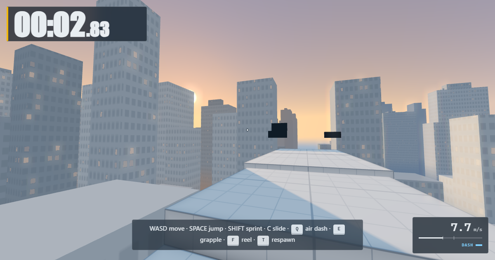

# aruvine.github.io

## Vaultline, at /vaultline/

- Play: https://aruvine.github.io/vaultline/
- Level designer: https://aruvine.github.io/vaultline/editor/

A first-person parkour time trial that runs in the browser. Built with three.js
(MIT). The source of the build lives in a private repo.

Sprint, slide, wall-run any wall, bunny-hop, air-dash and swing a grappling rope
off any surface, across a city at golden hour. Nothing to install and no account
to play; posting a time to the leaderboard uses a GitHub issue.

Press shots at full size are in `vaultline/press/`. They are real frames of the
current build, taken by `tools/capture-shots.mjs` in the source repo, so they can
be retaken instead of going stale; `vaultline/preview.png` is the 1200x630 card
the page's Open Graph tags point at, and renaming it breaks every link already
shared.

**Whatever deploys the build has to write to `vaultline/index.html`**, not to
`index.html`, since the game moved down a level.

## The leaderboard, at /board/

`board/` stays at the root and must not move: the build has
`BOARD_ORIGIN = 'https://aruvine.github.io'` and `BOARD_PATH = 'board/'` baked
in as an absolute URL, so the live game reads the board from the root whatever
folder the game itself is in.

A run is posted from the finish screen as an issue here. The Leaderboard action
checks it against the real level geometry, keeps each player's best, and commits
the result under `board/`.

## The pages at the root are redirects

Wind Bot's privacy policy and terms were served from here for part of a day and
now live on their own domain, https://windbot.app/, in the `Aruvine/windbot`
repository. `index.html`, `privacy.html` and `terms.html` here are one-line
redirects so links from that day still work. Edit the real pages in the other
repository; two copies of a legal page is how the wrong one gets edited.
